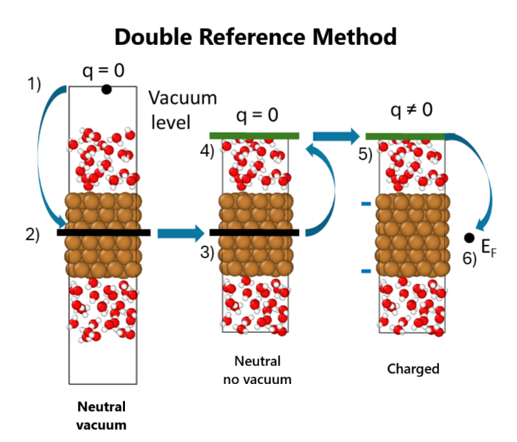

# DoubleReferenceMethod-FCP-calculator

## Introduction
We present a Fully-converged Constant Potential (FCP) *ase* calculator that is compatible with the [*Double Reference Method*](https://journals.aps.org/prb/abstract/10.1103/PhysRevB.73.165402) to simulate metal/water interfaces in an electronically grand-canonical ensemble.

The core of the package is the FCP calculator, implemented in [hellozhaoming/FCP-vasp-ase](https://github.com/hellozhaoming/FCP-vasp-ase), and properly customized to accept the evaluation of the Fermi level with respect to the vacuum level, as defined in the *Double Reference Method*. This quantity is evaluated via a series of references involving two auxiliary systems. This package fully automizes the handling of the reference systems required in the *Double Reference Method*:

 - a system without extra charge and a vacuum region ("Neutral vacuum system")
 - a system without extra charge and no vacuum ("Neutral no vacuum system")
 - a system with extra charge (i.e., applied potential) and no vacuum ("Charged system").



For detailed information see the original article of the [*Double Reference Method*](https://journals.aps.org/prb/abstract/10.1103/PhysRevB.73.165402), while for the integration of this calculator in a Machine Learning Potential workflow please check our paper [*Electrochemical Interfaces at Constant Potential: Data-Efficient Transfer Learning for Machine-Learning-Based Molecular Dynamics*](https://arxiv.org/abs/2511.19338).

## Contents

```text
├── DoubleReferenceMethod                 # Calculator folder
│   ├── FCPelectrochem2rm_bader.py        # FCP calculator
│   ├── DoubleReferenceWorkflow_calc.py   # High level functions implementing the Double Reference Workflow
│   └── utils.py                          # Auxiliary functions
├── Examples    
│   ├── PZC                               # example of application at PZC
│   └── Constant_potential                # example of application at constant applied potential
```

## Requirements
The following software have been used:
- ase package (from [ase/ase](https://gitlab.com/ase/ase))
- Macrodensity (from [WMD-group/MacroDensity](https://github.com/WMD-group/MacroDensity))
- VASP [package](https://www.vasp.at/)

> [!WARNING]  
> At the moment, only VASP is compatible with the FCP calculator and the entire workflow. Nonetheless, the flexibility of the package enables adaptation for other DFT engines.

Optional:
- Bader charge analysis code (from [Henkelman group](https://theory.cm.utexas.edu/henkelman/code/bader/))
- VTST tools for Bader post-processing (from [Henkelman group](https://theory.cm.utexas.edu/vtsttools/scripts.html)).

# Before you use

1. Make sure you have installed python and pip
3. Install ase via
    ```
    pip install ase
    ```
2. Install Macrodensity via
     ```
     pip install macrodensity
     ```
4. Copy [DoubleReferenceMethod](https://github.com/michelegiovannibianchi/FCP-calculator-DoubleReferenceMethod/tree/main/DoubleReferenceMethod) folder to "ase_installation_path/calculators/" (Note: ase_installation_path can be found by running 'ase info')
   
5. For ASE >=3.23.0, one should create a 'config.ini' file in '~/.config/ase/' with the follow content:
   ```
   [FCP]
   command = echo "FCP dummy command"
   ```

# How to use

Folder [Examples/Constant_potential](https://github.com/michelegiovannibianchi/FCP-calculator-DoubleReferenceMethod/tree/main/Examples/Constant_potential) reports a typical example of application.

*DoubleReferenceWorkflow_Const_Pot.py* file controls the workflow and it is composed by two parts:

1. Definition of the DFT calculators required for the different systems:

     - ```calc_neutral_no_vacuum``` for the "Neutral no vacuum system"
     - ``` calc_neutral_vacuum_no_dipole ``` and ```calc_neutral_vacuum_dipole``` for the "Neutral vacuum system" (the first is performed without dipole corrections and is meant to facilitate the convergence of the second with dipole corrections)
     - ```calc_charge``` for the "Charged system".
       
2. Call of a wrapper for the ```DoubleReferenceWorkflow``` function controlling the Double Reference workflow.

  The arguments of ```DoubleReferenceWorkflow``` are:
  ```
  Input: 
          - snap: ase atoms, 
              atomic geometry
  
          - external_bias_vector: list, 
              values of applied potential for which the Double Reference Method will be applied
  
          - calc_neutral_no_vacuum: ase calculator, 
              calculator for system without a vacuum region and no extra charge
  
          - calc_neutral_vacuum_no_dipole: ase calculator, 
              calculator for system with a vacuum region, but not dipole corrections
  
          - calc_neutral_vacuum_dipole: ase calculator, 
              calculator for system with a vacuum region, and with dipole corrections
  
          - calc_charge: ase calculator, 
              calculator for system without a vacuum region and extra charge
  
          - guess_extra_electrons: int, 
              initial guess of extra electrons to add to the system to the first point of the
              external_bias_vector 
              default:  0, i.e. start from the neutral system
  
          - C_guess: float, 
              initial guess for the capacitance of the interface
              default: 1/80 e/(V A^2) (same default value of the FCP2 calculator)
  
          - restart: bool, 
              if True the calculation will start from the calculation of the system with a vacuum region, and with dipole corrections
              default: False
  
          - V_SHE: float, 
              value of the standard hydrogen electrode potential
              default: 4.44 V
```

> [!NOTE]  
> The ```external_bias_vector``` parameter allows a list of various target potentials, enabling the computation of multiple potentials on the same geometry. This is beneficial since it only needs to compute the auxiliary systems once, and it speeds up the convergence of the FCP by proposing the guess of additional electrons among the target potentials using a linear charge-potential interpolation.

For reference, folder [Examples/PZC](https://github.com/michelegiovannibianchi/FCP-calculator-DoubleReferenceMethod/tree/main/Examples/PZC) reports an example at the PZC, with the same settings, but when there is no need of the auxiliary systems of the *Double Reference Method*.
 
## Citing
If you find this calculator useful, please cite our work using the following bibtex entry:
```
@misc{bianchi2025electrochemicalinterfacesconstantpotential,
      title={Electrochemical Interfaces at Constant Potential: Data-Efficient Transfer Learning for Machine-Learning-Based Molecular Dynamics}, 
      author={Michele Giovanni Bianchi and Michele Re Fiorentin and Francesca Risplendi and Candido Fabrizio Pirri and Michele Parrinello and Luigi Bonati and Giancarlo Cicero},
      year={2025},
      eprint={2511.19338},
      archivePrefix={arXiv},
      primaryClass={physics.comp-ph},
      url={https://arxiv.org/abs/2511.19338}, 
}
```
